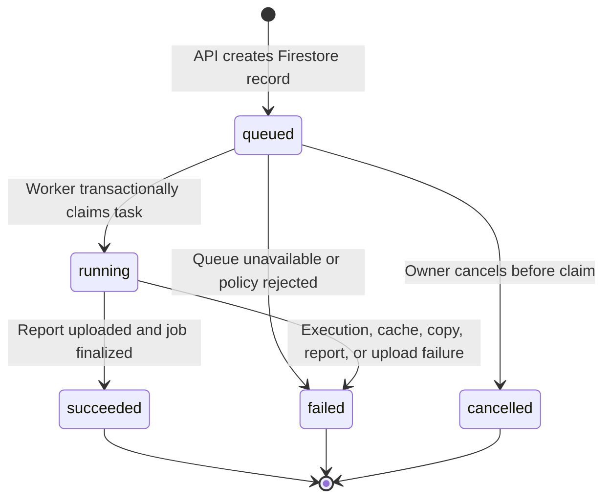

# GCS Search Macro v4 — Complete Work Diagram

This diagram covers the standalone hosted package: security boundary, API validation, durable jobs, Cloud Tasks dispatch, native GCS execution, BigQuery caching, report delivery, and owner-only operations.

```mermaid
flowchart TD
    user(["Authorized user"])
    vpn["Corporate VPN or approved network"]
    loadBalancer["HTTPS load balancer with Cloud Armor"]
    iap["Identity-Aware Proxy and group IAM"]
    api["Cloud Run API service"]
    identity{"Valid IAP identity and allowed email domain?"}
    rejectAuth(["Reject with 401 or 403"])

    subgraph requestLayer ["Request creation and authorization"]
        ui["Hosted browser UI"]
        scopeApi["GET approved scopes and allowed roots"]
        submit["POST job request with content or filename mode, scope, paths, terms, optional copy and email"]
        validate["Validate request model and administrator-owned scope policy"]
        policyOk{"Scope, limits, regex, copy target, and recipients allowed?"}
        rejectRequest(["Reject with 403 or 422"])
        queuedRecord["Create owner-bound Firestore job in queued state"]
        enqueue["Create deterministic Cloud Task carrying job ID only"]
        queueOk{"Task created?"}
        queueFail["Mark job failed with QUEUE_UNAVAILABLE"]
        accepted["Return 202 with job ID"]
    end

    subgraph dispatchLayer ["Protected task dispatch"]
        cloudTasks[("Cloud Tasks queue")]
        oidc["Attach OIDC token for task dispatcher service account"]
        worker["Cloud Run worker with container concurrency one"]
        taskGuard{"Cloud Tasks identity and header accepted?"}
        rejectWorker(["Reject direct worker invocation"])
        fetchJob["Read Firestore job by ID"]
        stillQueued{"Job still queued?"}
        revalidate["Revalidate current administrator policy"]
        policyStillValid{"Policy still valid?"}
        policyFail["Mark failed with POLICY_REJECTED"]
        claim["Transactionally claim job and set running"]
        claimWon{"Claim succeeded?"}
    end

    subgraph executionLayer ["Native isolated execution"]
        tempDir["Create per-job temporary directory"]
        resolve["Resolve approved bucket paths and job-scoped copy destination"]
        searchMode{"Content or filename search?"}
        manifest["List approved Python objects for content search"]
        filenameManifest["List every object extension and collect filename metadata"]
        limits{"File count and size within hosted limits?"}
        limitFail["Raise execution failure"]
        definition["Hash source definition and terms into query key"]
        cacheTables["Ensure BigQuery cache tables"]
        priorCache{"Completed cache snapshot for query key?"}
        fullSearch["Search file contents or classify exact/partial filenames"]
        loadPrevious["Load prior manifest and cached results"]
        diff{"Manifest changed?"}
        cacheHit["Reuse complete cached result set"]
        partialRefresh["Search only new and updated files"]
        merge["Remove deleted or affected cached rows and merge refreshed results"]
        persist["Persist append-only manifest and result snapshot; mark complete"]
        cacheFailure["Mark pending snapshot failed and raise"]
        audit["Write cache-access audit with hashed requester"]
    end

    subgraph reportLayer ["Current enrichment, delivery, and completion"]
        enrich["For content search, load current DAG status and optional job inventory"]
        copyDecision{"Approved copy requested?"}
        copy["Copy unique matches under destination jobs and job ID"]
        excel["Build and style Excel workbook"]
        workbookExists{"Workbook created?"}
        emptyReport["Create No_Matches workbook"]
        upload["Upload to private owner-namespaced reports bucket"]
        emailDecision{"Email recipients requested?"}
        email["Send XLSX through configured SMTP relay"]
        emailFailure["Ignore email failure; download remains available"]
        succeed["Set job succeeded with artifact and metrics"]
        fail["Set job failed with EXECUTION_FAILED"]
    end

    subgraph ownerActions ["Owner-only API operations"]
        poll["GET owned job status"]
        ownerCheck{"Job belongs to requester?"}
        hidden["Return 404 to prevent enumeration"]
        cancel["POST cancel"]
        cancelState{"Still queued?"}
        cancelled["Transactionally set cancelled"]
        conflict["Return 409 when running"]
        download["GET download"]
        reportReady{"Succeeded with artifact?"}
        signed["Generate 15-minute signed GCS URL"]
        unavailable["Return 409 report unavailable"]
    end

    user --> vpn --> loadBalancer --> iap --> api --> identity
    identity -->|"No"| rejectAuth
    identity -->|"Yes"| ui
    ui --> scopeApi --> submit --> validate --> policyOk
    policyOk -->|"No"| rejectRequest
    policyOk -->|"Yes"| queuedRecord --> enqueue --> queueOk
    queueOk -->|"No"| queueFail
    queueOk -->|"Yes"| cloudTasks
    queueOk -->|"Yes"| accepted

    cloudTasks --> oidc --> worker --> taskGuard
    taskGuard -->|"No"| rejectWorker
    taskGuard -->|"Yes"| fetchJob --> stillQueued
    stillQueued -->|"No"| accepted
    stillQueued -->|"Yes"| revalidate --> policyStillValid
    policyStillValid -->|"No"| policyFail
    policyStillValid -->|"Yes"| claim --> claimWon
    claimWon -->|"No; duplicate delivery"| accepted
    claimWon -->|"Yes"| tempDir --> resolve --> searchMode
    searchMode -->|"Content"| manifest --> limits
    searchMode -->|"Filename"| filenameManifest --> limits

    limits -->|"No"| limitFail --> fail
    limits -->|"Yes"| definition --> cacheTables --> priorCache
    priorCache -->|"No"| fullSearch --> persist
    priorCache -->|"Yes"| loadPrevious --> diff
    diff -->|"No"| cacheHit --> audit
    diff -->|"Yes"| partialRefresh --> merge --> persist
    persist -->|"Write succeeds"| audit
    persist -->|"Write fails"| cacheFailure --> fail

    audit --> enrich --> copyDecision
    copyDecision -->|"Yes"| copy --> excel
    copyDecision -->|"No"| excel
    excel --> workbookExists
    workbookExists -->|"No"| emptyReport --> upload
    workbookExists -->|"Yes"| upload
    upload --> emailDecision
    emailDecision -->|"Yes"| email
    email -->|"Success"| succeed
    email -->|"Failure"| emailFailure --> succeed
    emailDecision -->|"No"| succeed
    tempDir -.->|"Unhandled exception"| fail

    accepted --> poll --> ownerCheck
    ownerCheck -->|"No"| hidden
    ownerCheck -->|"Yes"| cancel
    cancel --> cancelState
    cancelState -->|"Yes"| cancelled
    cancelState -->|"Running"| conflict
    ownerCheck -->|"Yes"| download
    download --> reportReady
    reportReady -->|"No"| unavailable
    reportReady -->|"Yes"| signed

    style requestLayer fill:#E8F0FE,stroke:#4C78D0
    style dispatchLayer fill:#F3E8FD,stroke:#8E5BB7
    style executionLayer fill:#FFF4D6,stroke:#D99A00
    style reportLayer fill:#E6F4EA,stroke:#34A853
    style ownerActions fill:#FCE8E6,stroke:#D65C5C
```

## Job state transitions

## BigQuery cache contents

- `search_cache_run`: cache snapshot metadata and `PENDING`, `COMPLETE`, or `FAILED` state.
- `search_cache_manifest`: per-snapshot source object metadata.
- `search_cache_result`: exact and partial match rows by search term.
- `search_cache_access`: per-job audit record with a hashed requester identity.

The cache does not store full source text. DAG and inventory enrichment is loaded fresh for every job, even when search results are reused.
